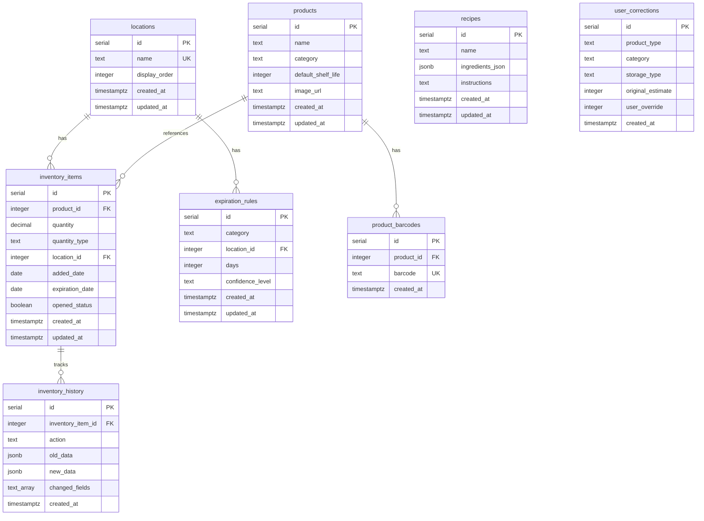

# Database Schema Documentation

## Overview

The Fridgr database schema is designed for a single-user kitchen inventory
management system. It supports flexible quantity tracking, multiple barcodes per
product, and complete change history for undo functionality.

## Entity Relationship Diagram



## Tables

### locations

Stores customizable storage locations for inventory items.

**Columns:**

- `id` (SERIAL PRIMARY KEY) - Unique identifier
- `name` (TEXT NOT NULL UNIQUE) - Location name (e.g., 'pantry', 'fridge',
  'freezer')
- `display_order` (INTEGER NOT NULL) - Order for displaying locations in UI
- `created_at` (TIMESTAMPTZ) - Creation timestamp
- `updated_at` (TIMESTAMPTZ) - Last update timestamp

**Default Locations:**

- pantry (display_order: 1)
- fridge (display_order: 2)
- freezer (display_order: 3)

**Relationships:**

- One-to-many with `inventory_items`
- One-to-many with `expiration_rules`

### products

Stores cached product information from barcode lookups.

**Columns:**

- `id` (SERIAL PRIMARY KEY) - Unique identifier
- `name` (TEXT NOT NULL) - Product name
- `category` (TEXT) - Product category (e.g., 'dairy', 'meat', 'produce')
- `default_shelf_life` (INTEGER) - Default shelf life in days
- `image_url` (TEXT) - URL to product image
- `created_at` (TIMESTAMPTZ) - Creation timestamp
- `updated_at` (TIMESTAMPTZ) - Last update timestamp

**Indexes:**

- `idx_products_category` - For filtering by category

### product_barcodes

Supports multiple barcodes per product (e.g., different package sizes).

**Columns:**

- `id` (SERIAL PRIMARY KEY) - Unique identifier
- `product_id` (INTEGER NOT NULL) - Foreign key to products
- `barcode` (TEXT NOT NULL UNIQUE) - Barcode value (UPC, EAN, etc.)
- `created_at` (TIMESTAMPTZ) - Creation timestamp

**Indexes:**

- `idx_product_barcodes_product_id` - For looking up all barcodes for a product
- Unique index on `barcode` - Ensures no duplicate barcodes

**Relationships:**

- Many-to-one with `products` (CASCADE delete)

### inventory_items

Tracks current inventory with flexible quantity types.

**Columns:**

- `id` (SERIAL PRIMARY KEY) - Unique identifier
- `product_id` (INTEGER) - Foreign key to products (nullable for manual entries)
- `quantity` (DECIMAL NOT NULL) - Quantity value
- `quantity_type` (TEXT NOT NULL) - Type: 'units', 'volume', 'percentage',
  'weight'
- `location_id` (INTEGER NOT NULL) - Foreign key to locations
- `added_date` (DATE NOT NULL) - Date item was added
- `expiration_date` (DATE) - Estimated expiration date
- `opened_status` (BOOLEAN) - Whether item is opened
- `created_at` (TIMESTAMPTZ) - Creation timestamp
- `updated_at` (TIMESTAMPTZ) - Last update timestamp

**Constraints:**

- `quantity_type` must be one of: 'units', 'volume', 'percentage', 'weight'

**Indexes:**

- `idx_inventory_items_expiration` - For finding items expiring soon
- `idx_inventory_items_location_id` - For filtering by location
- `idx_inventory_items_product_id` - For joining with products
- `idx_inventory_items_expiration_location` - Composite for common queries

**Relationships:**

- Many-to-one with `products` (SET NULL on delete)
- Many-to-one with `locations` (RESTRICT on delete)
- One-to-many with `inventory_history` (CASCADE delete)

### inventory_history

Tracks all changes to inventory items for undo functionality.

**Columns:**

- `id` (SERIAL PRIMARY KEY) - Unique identifier
- `inventory_item_id` (INTEGER NOT NULL) - Foreign key to inventory_items
- `action` (TEXT NOT NULL) - Action type: 'created', 'updated', 'deleted'
- `old_data` (JSONB) - Previous state (for updates/deletes)
- `new_data` (JSONB) - New state (for creates/updates)
- `changed_fields` (TEXT[]) - Array of field names that changed
- `created_at` (TIMESTAMPTZ) - When the change occurred

**Constraints:**

- `action` must be one of: 'created', 'updated', 'deleted'

**Indexes:**

- `idx_inventory_history_item_id` - For getting history of an item
- `idx_inventory_history_created_at` - For chronological queries
- `idx_inventory_history_item_created` - Composite for undo queries

**Relationships:**

- Many-to-one with `inventory_items` (CASCADE delete)

**Usage for Undo:** To undo a change, query the most recent history entry for an
item and restore the `old_data` values.

### recipes

Stores recipe collection with structured ingredients.

**Columns:**

- `id` (SERIAL PRIMARY KEY) - Unique identifier
- `name` (TEXT NOT NULL) - Recipe name
- `ingredients_json` (JSONB NOT NULL) - Array of ingredient objects:
  `[{item, quantity, unit}, ...]`
- `instructions` (TEXT) - Recipe instructions
- `created_at` (TIMESTAMPTZ) - Creation timestamp
- `updated_at` (TIMESTAMPTZ) - Last update timestamp

**Indexes:**

- `idx_recipes_ingredients_gin` - GIN index for JSON queries on ingredients

**Example ingredients_json:**

```json
[
    { "item": "flour", "quantity": 2, "unit": "cups" },
    { "item": "eggs", "quantity": 3, "unit": "units" },
    { "item": "milk", "quantity": 1, "unit": "cup" }
]
```

### expiration_rules

Stores AI-generated expiration rules by category and storage type.

**Columns:**

- `id` (SERIAL PRIMARY KEY) - Unique identifier
- `category` (TEXT NOT NULL) - Product category
- `location_id` (INTEGER NOT NULL) - Foreign key to locations
- `days` (INTEGER NOT NULL) - Shelf life in days
- `confidence_level` (TEXT NOT NULL) - Confidence: 'HIGH', 'MEDIUM', 'LOW'
- `created_at` (TIMESTAMPTZ) - Creation timestamp
- `updated_at` (TIMESTAMPTZ) - Last update timestamp

**Constraints:**

- `confidence_level` must be one of: 'HIGH', 'MEDIUM', 'LOW'
- Unique constraint on `(category, location_id)`

**Indexes:**

- `idx_expiration_rules_category` - For looking up by category
- `idx_expiration_rules_location_id` - For looking up by location
- Unique index on `(category, location_id)`

**Relationships:**

- Many-to-one with `locations` (RESTRICT on delete)

### user_corrections

Tracks user corrections to AI estimates for learning system.

**Columns:**

- `id` (SERIAL PRIMARY KEY) - Unique identifier
- `product_type` (TEXT NOT NULL) - Type of product
- `category` (TEXT) - Product category
- `storage_type` (TEXT) - Storage location (deprecated, kept for historical
  data)
- `original_estimate` (INTEGER NOT NULL) - Original AI estimate in days
- `user_override` (INTEGER NOT NULL) - User's corrected value in days
- `created_at` (TIMESTAMPTZ) - When correction was made

**Indexes:**

- `idx_user_corrections_product_type` - For analyzing by product type
- `idx_user_corrections_category` - For filtering by category
- `idx_user_corrections_product_category` - Composite for analysis

## Triggers

### update_updated_at_column

Automatically updates the `updated_at` timestamp on UPDATE operations.

**Applied to:**

- `products`
- `inventory_items`
- `recipes`
- `expiration_rules`

### track_inventory_changes

Automatically creates history records for all changes to inventory items.

**Applied to:**

- `inventory_items` (AFTER INSERT, UPDATE, DELETE)

**Behavior:**

- On INSERT: Creates history record with `action='created'` and `new_data`
- On UPDATE: Creates history record with `action='updated'`, `old_data`,
  `new_data`, and `changed_fields`
- On DELETE: Creates history record with `action='deleted'` and `old_data`

## Common Query Patterns

### Lookup Product by Barcode

```sql
SELECT p.*
FROM products p
JOIN product_barcodes pb ON p.id = pb.product_id
WHERE pb.barcode = '1234567890123';
```

### Get Items Expiring Soon

```sql
SELECT *
FROM inventory_items
WHERE expiration_date BETWEEN CURRENT_DATE AND CURRENT_DATE + INTERVAL '3 days'
ORDER BY expiration_date;
```

### Get Inventory History for Undo

```sql
SELECT *
FROM inventory_history
WHERE inventory_item_id = 123
ORDER BY created_at DESC
LIMIT 10;
```

### Search Recipes by Ingredient

```sql
SELECT *
FROM recipes
WHERE ingredients_json @> '[{"item": "flour"}]';
```

### Get Expiration Rule

```sql
SELECT er.days, er.confidence_level
FROM expiration_rules er
JOIN locations l ON er.location_id = l.id
WHERE er.category = 'dairy' AND l.name = 'fridge';
```

### Get All Locations

```sql
SELECT id, name, display_order
FROM locations
ORDER BY display_order;
```

## Index Strategy

Indexes are designed to optimize the most common query patterns:

1. **Barcode lookups** - Unique index on `product_barcodes.barcode`
2. **Expiration queries** - Index on `inventory_items.expiration_date`
3. **Location filtering** - Index on `inventory_items.location_id`
4. **History queries** - Composite index on
   `(inventory_item_id, created_at DESC)`
5. **JSON searches** - GIN index on `recipes.ingredients_json`
6. **Category lookups** - Indexes on category columns

## Change Tracking and Undo

The `inventory_history` table enables undo functionality:

1. **View History**: Query `inventory_history` for an item to see all changes
2. **Undo Update**: Restore `old_data` values from the most recent 'updated'
   entry
3. **Undo Delete**: Restore `old_data` to recreate a deleted item
4. **Track Changes**: Use `changed_fields` array to show what was modified

Example undo query:

```sql
-- Get the most recent change
SELECT old_data
FROM inventory_history
WHERE inventory_item_id = 123
ORDER BY created_at DESC
LIMIT 1;
```
